# Oral Cancer Prediction & Analysis (Full Data Mining Project)

This repository contains a comprehensive data mining project analyzing oral cancer risk factors. The project was conducted in two phases (Maman 21 & Maman 22), covering the full Knowledge Discovery in Databases (KDD) lifecycle using the WEKA environment.

---

## 🟢 Part 1: Data Preprocessing & Classification (Maman 21)

### 📊 Project Methodology (KDD Process)
- **Data Collection & Cleaning**: Handled duplicate records to ensure data integrity.

- **Data Transformation**: Performed discretization on the 'Age' attribute to improve model performance.
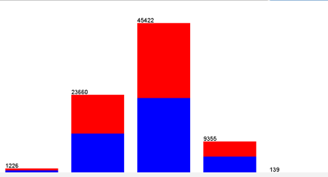

- **Attribute Selection**: Applied Information Gain analysis to identify the most predictive features.
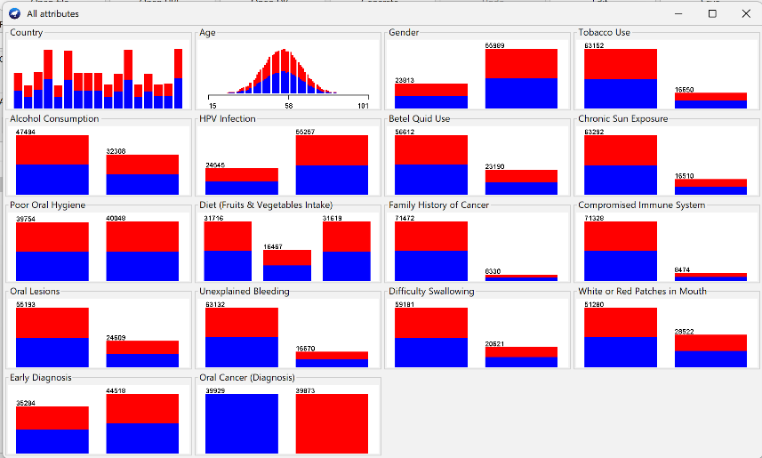
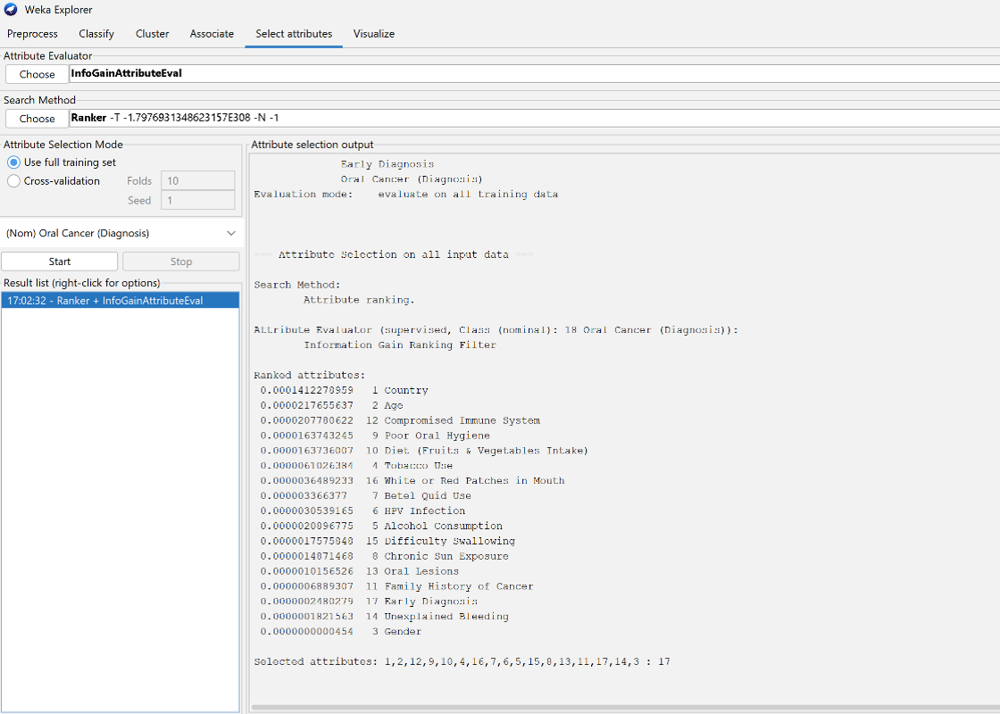

### 🤖 Models & Classification
#### 1. ID3 Algorithm
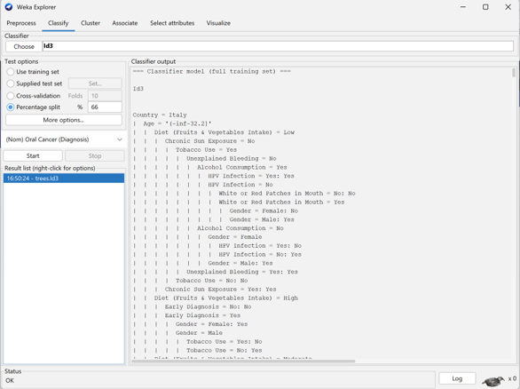
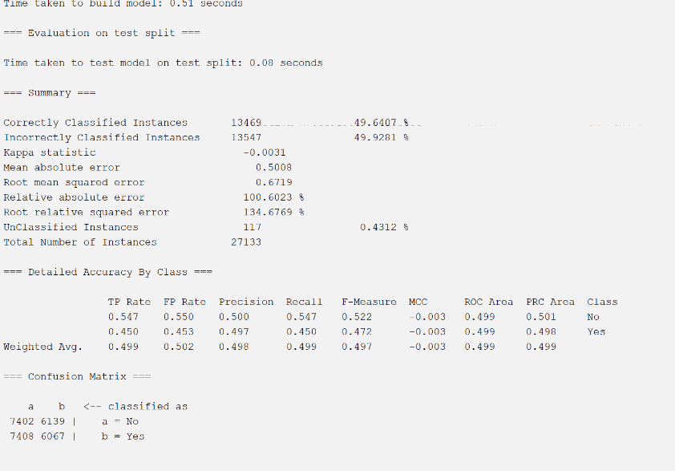

#### 2. J48 Algorithm (C4.5)
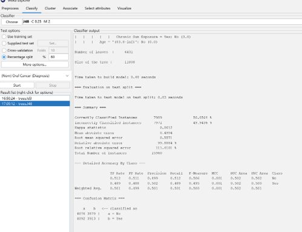
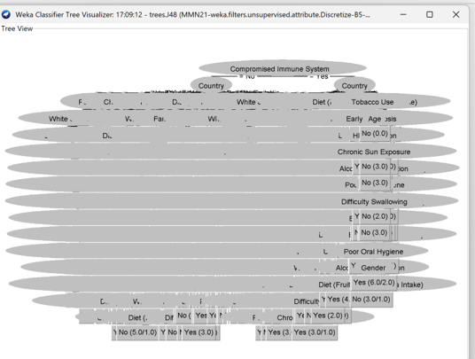

📄 **[View Full Part 1 Report (Maman 21)](MMN21...pdf)** 

---

## 🔵 Part 2: Advanced Analysis & Unsupervised Learning (Maman 22)

### 1. Association Rules (Apriori)
Used to identify behavioral patterns linked to health outcomes. 
- **Key Insight**: Identified strong associations between risk behaviors (smoking, alcohol) and the target variable.
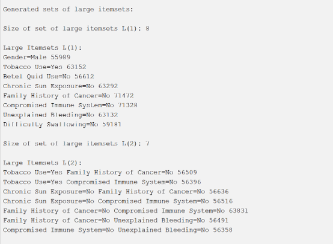
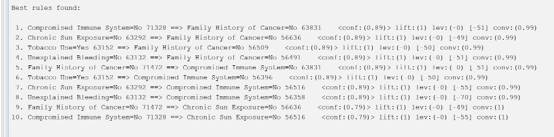

### 2. Clustering (K-Means)
Attempted to group patients without target labels. The algorithm formed two clusters primarily based on dietary habits, but failed to separate patients based on their cancer diagnosis.
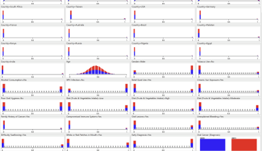
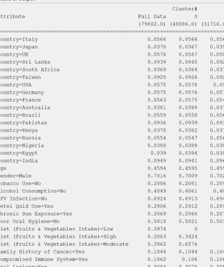

### 3. Neural Networks (MLP)
Implemented a Multi-Layer Perceptron (3 layers, 10 hidden neurons) to capture complex non-linear relationships.
- **Results**: Accuracy remained around 49.8%, and the error convergence was slow, confirming the inherent noise and limitations in the dataset.

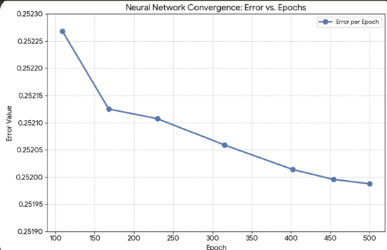

📄 **[View Full Part 2 Report (Maman 22)](MMN22.pdf)** 

---

## 🏁 Final Conclusion
Across all models—supervised and unsupervised—the algorithms performed correctly, but the accuracy consistently hovered around 50%. This project demonstrates a crucial data science principle: **data quality dictates model quality**. Predicting clinical diagnoses requires robust medical data (e.g., lab tests, genetics) rather than just lifestyle surveys.

## 🛠️ Technical Stack
- **Tools**: WEKA, Microsoft Excel.
- **Algorithms**: ID3, J48, Apriori, K-Means, Multi-Layer Perceptron.
- **Dataset**: Processed patient records (`MMN21.csv`).
